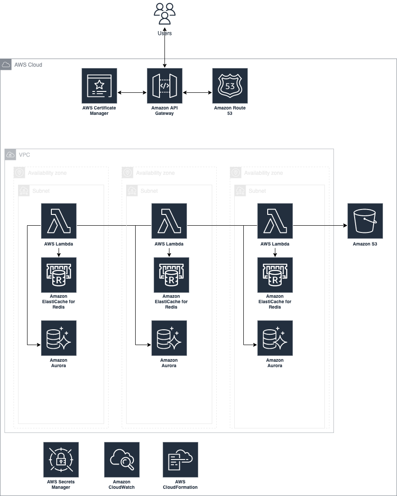

# Didomi DevOps challenge

To find out the requirements you can check in the next [link](https://github.com/didomi/challenges/tree/master/devops)

## General Information

For this API infrastructure provisioning it was posible just to use serverless framework and terraform. The main resources to be provisioned are the below:

- A VPC with private subnets
- An IAM user for Gitlab to run the deployment for the lambda in the pipeline
- Policies for the Gitlab user with the minimal required permissions to run the deployment
- An API Gateway that will handle the incoming requests
- A lambda that would connect to the RDS, do some processing, and return a response
- An RDS database that can handle at scale concurrency for our deployed Lambda
- The configuration required to make requests go through a custom domain (Route53, ACM, etc.)
- Other resources that you think are appropriate to deploy this architecture at scale

**Terraform stack is responsible for:**

- VPC setup
- IAM user for CICD with his IAM Policy
- RDS Aurora cluster
- RDS Proxy
- Elasticache Redis cluster
- All required security groups including for Lambda function
- Route53 Hosted Zone setup
- ACM certificate creation and validation
- S3 bucket for large files
- Secret in Secrets Manager to handle the secrets for RDS database connection

The Elasticache cluster was provisioned in order to protect and help the database to support at scale the request for the API and Lambda Functions. 

The RDS proxy was setup in order to make the api more scalable, more resilient to database failures, and more secure.

**Serverless stack is responsible for:**

- API Gateway
- Route53 record setup
- Lambda functions to connect to RDS, S3 and return responses through the API Gateway
- IAM Role for Lambda function
- CloudWatch log group for Lambda function
- CloudFormation stack (Required for serverless framework)
- S3 deployment bucket (Required for serverless framework)

In the image below you can find an architecture diagram with the main components. The diagram is not 100% accurate but it tries to demostrate the data flow and the resources that will be deployed using this terraform and serverless stack.

You can find more documentation for terraform and serverless in the README.md file that exists for each folder.

## Assumptions

- There is not accurate information about the data that we are storing in S3 or in the database, so the first assumption is that the information should be encryp but it doesn't require audit stuff about the encryption process. So I decided to use AWS KMS managed keys.
- There is notenough information about the data stored in S3 bucket. So, I decided to avoid any lifecycle for the data stored there.
- I assumed that is not mandatory to have logging setup for the S3 bucket.
- Any code development was made for the lambda stuff. Please check the little recommendations for development in the next section.
- The information provided is not enough to determine what we want to achieve with the API. One recommendation to increase the performance for lambda and also protect that is to use SQS. I decided to avoid this setup because it adds many complex because most of the operations through the API Gateway will be async.

## Recommendations For Development

- To download S3 big files we can use some strategies. Some strategies involved setup in the infrastructure side, like using vpc endpoints or EFS systems. For this setup I would like to recommen that the develop for the S3 bucket downloads use multipart feature from S3 and check out streams in nodejs.
- Get the database secrets directly from secrets manager using the aws-sdk should be the best practice for the lambda functions. Right now there is a environment variables available but probably we can delete that and just use the secret manager directly.

## Next Steps and Improvements

If posible for getting more information about the API purpose , the budget available and the security requirements, more infrastructure features could be enable. There is a little list below of posible improvements and next steps:

- Customer managed KMS keys to enable more security in the system and also provide a way to audit all the calls to the KMS operations.
- EFS to store S3 large objects in order to improve the download time for the lambda functions. EFS and Lambda Functions have a directly integration without a lot of development required.
- Instead of using IAM user directly for the CICD process, it could be more secure just use an IAM User with the permissions to Assume different roles that will have the required permissions to setup the infrastructure and make the deployment.
- The IAM User for CICD just include the permissions required to deploy the serverless stack. I strongly recommend to include also the permissions for the terraform stuff in order to be able to introduce the terraform deployment process in the CICD tool.
- Protection for the API Gateway using AWS WAF could be a nice to have.
- For the API Gateway could be helpful to have api usage plans and api keys in order to have more control about the API itself.
- Adding some CloudWatch alarms and dashboard could help to improve the capacity to troubleshoot the API issues.
